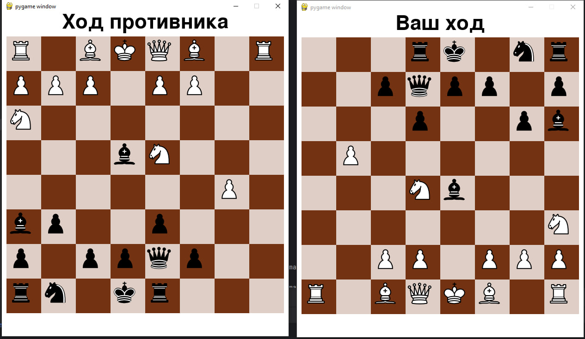

# P2P-Chess

p2p Шахматы с использованием pygame и веб-сокетов для игры через интернет

## Требования для игры:

1. Создать виртуальную среду, используя
```
python3 -m venv venv
```
2. Установить pygame, используя pip:
```
pip install pygame
```


## Как играть в игру:

1. Клонируйте этот репозиторий, набрав в командной строке:

```
https://github.com/amerk-dev/p2p-chess.git
```

2. Запустите сервер:

```
py server.py
```

3. В отдельном терминале запустите игру:

```
py test.py
```

# Демонстрация
